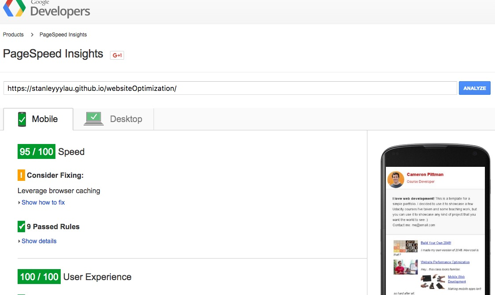

# Website Optimization project

Optimize the website provided by Udacity so it achieves a target PageSpeed score and runs at 60 frames per second.

## Performance Improvements

- Using embedded CSS to remove rendering block
- Minimise HTML, CSS and JavaScript to reduce file size
- Select Pizza Elements at once, instead of collecting them every time during update their positions
- Reduce the number of pizzas displayed on the screen based on the current viewport height

## How to run this?

Simply download this repo to your local computer, and click the index.html to open in your browser or visit https://stanleyyylau.github.io/websiteOptimization/

